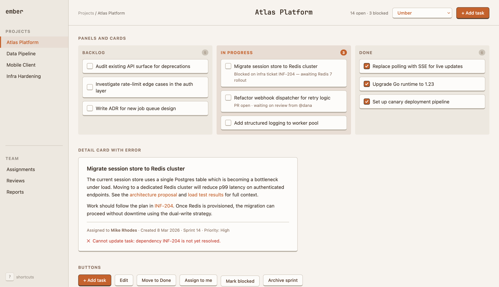
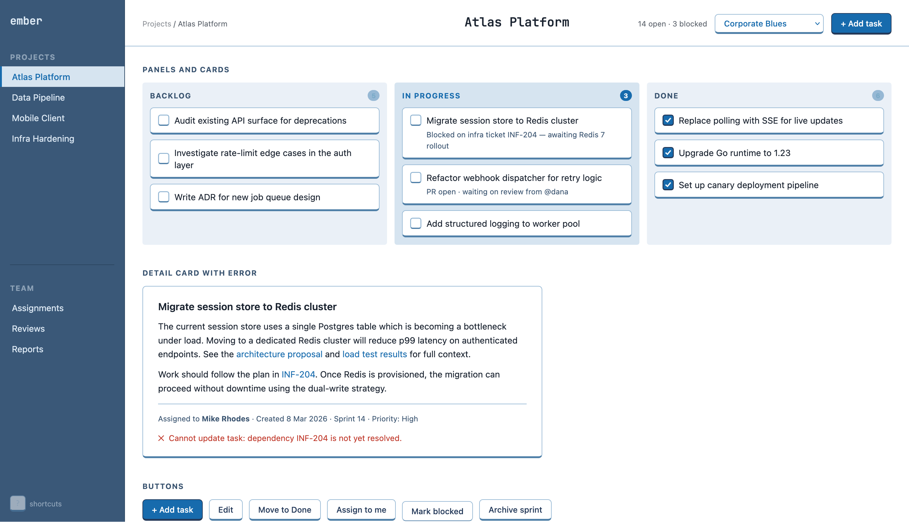

# ember-system

A Claude Code skill demonstrates one way to apply a consistent visual style to HTML tools you build with AI.

## What it is

When you ask Claude Code to build a one-off HTML tool, the result works but looks generic. This skill shows one way to fix that. Instead of writing CSS from scratch each time, Claude reads a design system — components, variables, typography rules — and applies it to whatever you're building.

I built this whole skill from a nice touch that Claude made when styling keyboard shortcuts. I really like the "raised" style it used for the shortcut, so I prompted Claude to restyle the app I was building around it --- a bunch of prompts later, I had a style I really liked.

Then I realised I could reuse it by getting Claude to help me make a simple [design system](https://en.wikipedia.org/wiki/Design_system) that I could use to re-skin HTML applications I made.

This repository is intended as a demonstration. You can build a skill like this for yourself, based on your tastes.

Pick websites whose colour palettes or visual style you like. Paste screenshots into Claude and ask it to help you extract a design system from them. Use that system as the basis for a skill. Every HTML tool you build after that will look the way you want it to — just ask Claude to "update this project to use MY_DESIGN_SYSTEM".

## This skill's style

You might of course like this style too, in which case, you can reuse my work!

There are three colour schemes included:

1. Umber - warm terracotta on cream.
2. Solarized - based on the [solarized](https://ethanschoonover.com/solarized/) colour palette.
3. Corporate Blues - a bolder blue-on-white them that feels a bit more ready for corporate use.

Each has a light and dark version. The `SKILL.md` file shows the agent how to use these for auto-switching themes.

Even if you don't like the bundled colour schemes, they show enough that Claude should be able to make one you like: "make an aubergine theme for ember-system".


*Umber*


*Corporate Blues*

## Using the skill

Copy `skills/ember-system` into `~/.claude/skills/`:

```sh
cp -r skills/ember-system ~/.claude/skills/ember-system
```

Then ask Claude to build or style something:

> Build a task tracker. Use ember-system with the Umber theme.

Claude will read the design guide, pick up the CSS, and produce styled HTML that brings in `ember.css` and the chosen theme file.
