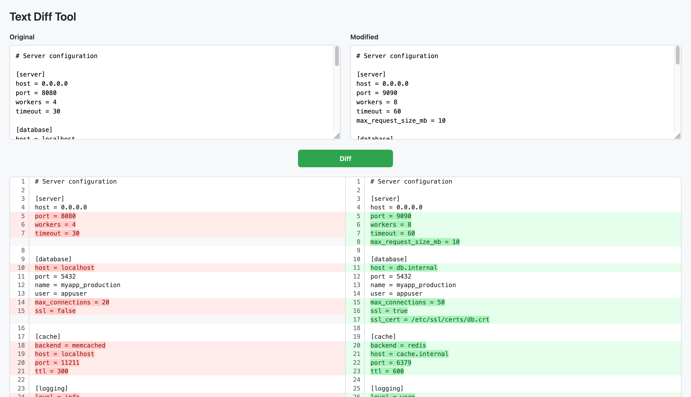
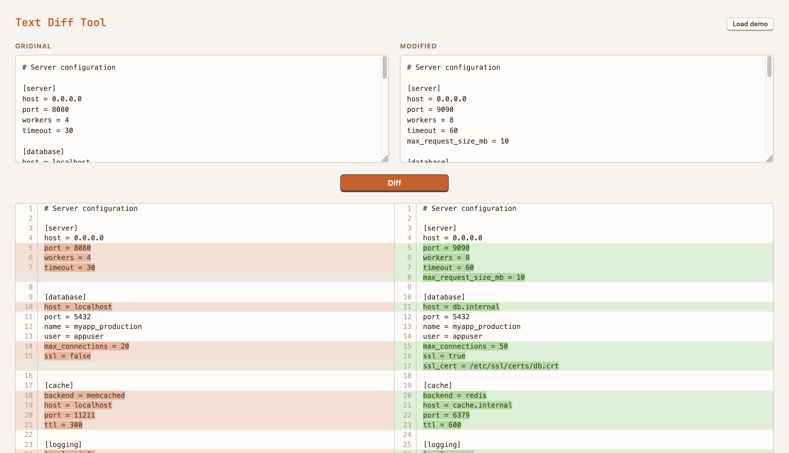

# ember-system

I'm interested in understanding how it can be made easier for anyone to make or customise their tools with AI. Part of that is making those tools nice to use; I don't think people should need to choose between _ugly-and-mine_ or _pretty-and-someone-else's_.

So this is an experiment: can we use Claude to build a simple design system. Design systems provide reusable styling and components. If we can build a simple design system --- components, typography, colours  --- and then describe this in a way an agent can use, then we can start to build libraries of styles for people to use in their apps.

My hope is that the basic HTML styles used by AI agents can be improved with a simple "apply ember-system to this project". The working example is a style I like, so I can use it, but the technique is general.

It's built as a Claude Code skill so it's easy for the agent to use. So far, it's for plain HTML/CSS/JS, no frameworks. Here's an example of how the skill can help update [a simple application][app]:

| Before | After |
|--------|-------|
|  |  |

[app]: https://github.com/mikerhodes/tools/tree/main/001-browserdiff

## How I built it

I built this whole skill from a nice touch that Claude made when styling a keyboard shortcut in a simple Kanban HTML app I was writing. It used a raised style to make it look like a raised key cap. Quite a common style, but one I'm fond of. So I prompted Claude to adopt this style across the app. A bunch of prompts and tweaks later, and I had a style I really liked. But for just this one app.

Then I realised I could reuse it by getting Claude to help me make a simple [design system](https://en.wikipedia.org/wiki/Design_system) that I could use to re-skin HTML applications I made:

1. I asked Claude to write a design guide based on the conversation we'd had to style the Kanban app. I also got Claude to write out a HTML page to demo the style.
1. Once we had the HTML demo page, I prompted Claude with tweaks to a lot of the components --- darken this, lighten that, this shouldn't be in a card and so on. That iterated both the CSS in the demo and the guide.
    - I used both text and images for this. I am still surprised by how effective Claude is at interpreting images.
1. Next we worked that into a skill. We broke out the CSS into a separate file so the using agent doesn't need to read all the HTML if it doesn't need to. We further separated the colour schemes to make it clearer they exist separately. I asked Claude to check the guide and demo matched up.
1. And then we had it, and now you have it.

## Make it your own

This repository is intended as a demonstration. You can build a skill like this for yourself, based on your tastes.

Pick websites whose colour palettes or visual style you like. Paste screenshots into Claude and ask it to help you extract a design system from them. Use that system as the basis for a skill. Every HTML tool you build after that will look the way you want it to — just ask Claude to "update this project to use MY_DESIGN_SYSTEM".

## This skill's style

It's a somewhat cliched retro-raised style. That makes it easy to build with Claude, as there's plenty of data in the training set. But it's a style I like, so it's nice be be able to "skin" my tools using it.

You might of course like this style too, in which case, you can reuse my work!

There are three colour schemes included:

1. Umber - warm terracotta on cream.
2. Solarized - based on the [solarized](https://ethanschoonover.com/solarized/) colour palette.
3. Corporate Blues - a bolder blue-on-white them that feels a bit more ready for corporate use.

Each has a light and dark version. The `SKILL.md` file shows the agent how to use these for auto-switching themes.

Even if you don't like the bundled colour schemes, they show enough that Claude should be able to make one you like: "make an aubergine theme for ember-system". Or just do it yourself, there are not so many colours to figure out.


*Umber*


*Corporate Blues*

## Using the skill

Copy `skills/ember-system` into `~/.claude/skills/`:

```sh
cp -r skills/ember-system ~/.claude/skills/ember-system
```

Then ask Claude to build or style something:

> Rework this project to use ember-system with the Umber theme.

Claude will read the design guide, pick up the CSS, and produce styled HTML that brings in `ember.css` and the chosen theme file.
